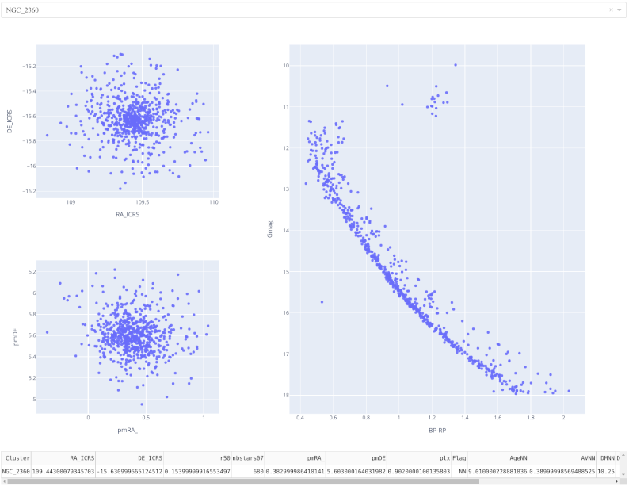

# rdroc
Reddening and differential reddening in open clusters  
> Status: In development

Code used as part of the course Initiation to the investigation II, CITEVA, UA.

## How it works
1. Load catalogs of star clusters from Vizier. To include a new catalog, add it to `catalogs.yaml` file folowing the same structure than the others. It will download automatically at start.

2. In the top left corner select the cluster from the drop down menu.

3. Run the app using the following command: `python main.py`

